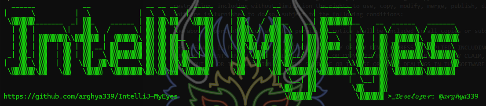
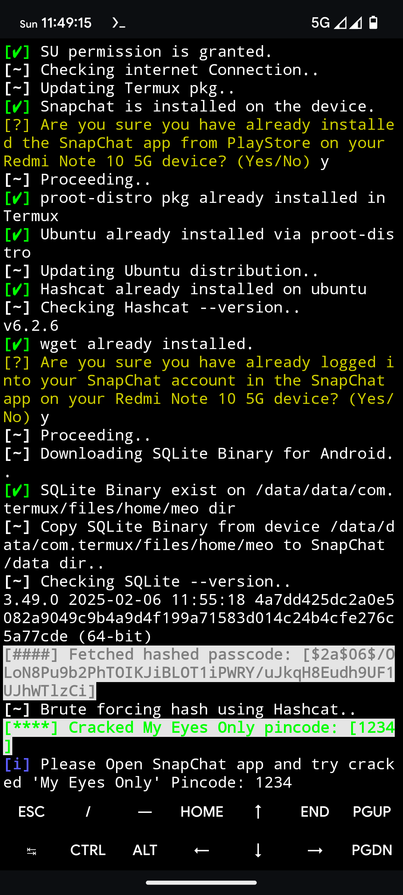
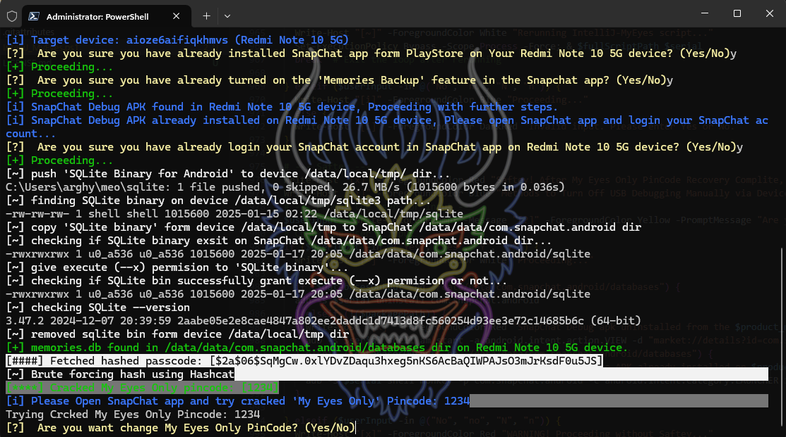

<h1 align="center">IntelliJ MyEyes</h1>
<p align="center">
Automate the process of Brute Forcing the SnapChat My Eyes Only PinCode.
<br>
<br>

<br>
<b> This Script works on both rooted and 𝚗̶𝚘̶𝚗̶-̶𝚛̶𝚘̶𝚘̶𝚝̶𝚎̶𝚍̶ Android devices without superuser permission! </b>
<br>

## Purpose
- This script automates the process of recovering `My Eyes Only` PIN Codes from SnapChat app.

## Prerequisites
- Android device with USB debugging enabled (and enable it form Developer options and you can enable Developer options by tapping the build number 7 times from Device Settings)
- Android device with SanpChat installed (and you know your SnapChat accouts password with Memories Smart Backup feature enabled)
- [CorePatch](https://github.com/LSPosed/CorePatch/releases) [LSPosed](https://github.com/JingMatrix/LSPosed/releases) Module hook in System Framework to bypass android system signature varification.
- A PC [Windows 10 1809 (build 17763) or later (Windows 11)] or ~~mac~~ with working internet connection and Microsoft [DesktopAppInstaller](https://apps.microsoft.com/detail/9nblggh4nns1) known as [winget-cli](https://github.com/microsoft/winget-cli/releases/latest)
- Latest Microsoft PowerShell (and you can check PowerShell Version uisng following command ~ `$PSVersionTable`)

## Usage
### 
  Open [Termux](https://github.com/termux/termux-app/releases/) and paste following command then press `Enter` key:
  ```sh
  curl --progress-bar -o "$HOME/IntelliJ_MyEyes.sh" "https://raw.githubusercontent.com/arghya339/IntelliJ-MyEyes/refs/heads/main/IntelliJ_MyEyes.sh" && bash "$HOME/IntelliJ_MyEyes.sh"
  ```
  Run the script with the following command:
  ```sh
  bash ~/IntelliJ_MyEyes.sh
  ```
  > [!NOTE]
  > Android script required superuser permission!

### 
  - Open `Windows Terminal (Admin)`
  - Install Microsoft PowerShell on Windows using winget (Windows built in package manager): ~ `winget install Microsoft.PowerShell --accept-source-agreements --silent --force`
  - Check MsPS Verison ~ `pwsh -v`
  - Remove the existing WindowsPowerShell directory: ~ `Remove-Item $env:USERPROFILE\Documents\WindowsPowerShell -Force -Recurse`
  - Open `Microsoft Terminal` right click in the `tab row` >  `Settings` > `Startup` > from `Default profile` `drop-down menu` select `PowerShell` > `Save` > Close `Windows Terminal` window
  - Open `Windows Terminal (Admin)`
  - Check MicrosoftPowerShell Version: ~ `$PSVersionTable`
  - Open [Microsoft PowerShell](https://github.com/PowerShell/PowerShell) Terminal (Admin) and run the script with the following command:

  ```pwsh
  Invoke-WebRequest -Uri https://raw.githubusercontent.com/arghya339/IntelliJ-MyEyes/refs/heads/main/IntelliJ_MyEyes.ps1 -OutFile "$env:USERPROFILE\Downloads\IntelliJ_MyEyes.ps1"
  ```

  ```pwsh
  Set-ExecutionPolicy Bypass -Scope Process -Force; & "$env:USERPROFILE\Downloads\IntelliJ_MyEyes.ps1"
  ```

> [!NOTE]
> This script was tested on an Windows 11 Pro with MicrosoftPowerShell v7.4.6

> [!WARNING]
> WindowsPowerShell (including latest v5.1.26100.2161) Not compatible with this script

> [!NOTE]
> This script was tested on an Android device running Android 14 with AOSP based custom ROM with CorePatch LSPosed Module hook in System Framework with SnapChat v13.24.1.0 .

## Troubleshoot

- [hashed_passcode_null_error](../../blob/main/docs/hashed_passcode_null_error.md)

## Safety!
> [!TIP]
> After My Eyes Only PinCode Recovery Complete, Please disabled Developer options from Device Settings. or uninstall SnapChat Debug APK and install SnapChat Release APK form Google PlayStore."

## Dependencies
["Chocolatey"](https://github.com/chocolatey/choco) [[Apache 2.0]](https://github.com/chocolatey/choco/blob/develop/LICENSE), ["Java"](https://www.java.com/en/download/) [GFTC], ["Android SDK"](https://developer.android.com/tools) [Apache 2.0], ["Python"](https://www.python.org/downloads/) [PSF / GPL], ["SQLite"](https://github.com/sqlite/sqlite) [[BSD-style]](https://github.com/sqlite/sqlite/blob/master/LICENSE.md), ["Hashcat"](https://github.com/hashcat/hashcat) [[MIT]](https://github.com/hashcat/hashcat/blob/master/docs/license.txt), ["APKEditor"](https://github.com/REAndroid/APKEditor) [[Apache 2.0]](https://github.com/REAndroid/APKEditor/blob/master/LICENSE), ["makeDebuggable"](https://github.com/julKali/makeDebuggable) [Apache 2.0]"

## How it works (_[Demo on YouTube](https://youtu.be/5IjG4nY2Bog)_)
SnapChat saves the 4 digit My Eyes Only (MEO) PinCode encrypted using [Bcrypt](https://en.wikipedia.org/wiki/Bcrypt) in `/data/data/com.snapchat.android/databases/memories.db`.





Once you've gotten the hash and saved it into a file (eg.`meohash.txt`), you can use `hashcat` to brute force it using the following command:
```
hashcat --attack-method 3200 --attack-mode 3 meohash.txt "?d?d?d?d"
```

## Disclaimer
- This script is for educational purposes only. 
- Modifying and reinstalling APKs can be risky and may violate app terms of service or legal regulations. 
- Use it responsibly and at your own risk.

## Devoloper info
- Powered by [Hashcat](https://github.com/hashcat/hashcat)
- Inspired by [meobrute](https://github.com/sdushantha/meobrute)
- Developer: [@arghya339](https://github.com/arghya339)

## Happy Cracking!
