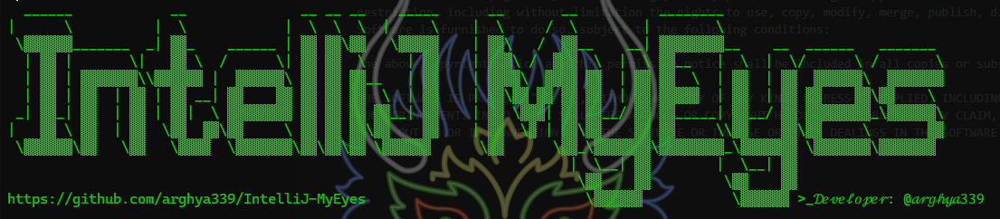
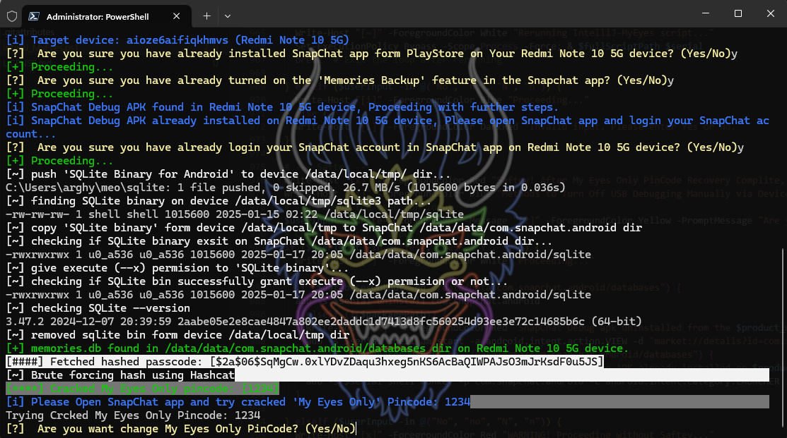

<h1 align="center">IntelliJ MyEyes</h1>
<p align="center">
Automate the process of Brute Forcing the SnapChat My Eyes Only PinCode.
<br>
<br>

<br>
<b> This Script works on both rooted and non rooted Android devices! </b>
<br>

## Purpose
- This script automates the process of recovering `My Eyes Only` PIN Codes from SnapChat app.

## Prerequisites
- Android device with USB debugging enabled (and enable it form Developer options and you can enable Developer options by tapping the build number 7 times from Device Settings)
- Android device with SanpChat installed (and you know your SnapChat accouts password with Memories Smart Backup feature enabled)
- A PC with working internet connection
- Latest PowerShell (and you can check PowerShell Version uisng following command ~ `$PSVersionTable`)

## Usage
- Open `Windows Terminal (Admin)`
- Install Microsoft PowerShell on Windows using winget (Windows built in package manager): ~ `winget install Microsoft.PowerShell --silent --force`
- Check MsPS Verison ~ `pwsh -v`
- Remove the existing WindowsPowerShell directory: ~ `Remove-Item $env:USERPROFILE\Documents\WindowsPowerShell -Force -Recurse`
- Open `Microsoft Terminal` right click in the `tab row` >  `Settings` > `Startup` > from `Default profile` `drop-down menu` select `PowerShell` > `Save` > Close `Microsoft Terminal` window
- Open `Windows Terminal (Admin)`
- Check MicrosoftPowerShell Version: ~ `$PSVersionTable`
- Open [PowerShell](https://github.com/PowerShell/PowerShell) Terminal (Admin) and run the script with the following command:

```
Invoke-WebRequest -Uri https://raw.githubusercontent.com/arghya339/IntelliJ-MyEyes/refs/heads/main/IntelliJ_MyEyes.ps1 -OutFile "$env:USERPROFILE\Downloads\IntelliJ_MyEyes.ps1"
```

```
Set-ExecutionPolicy Bypass -Scope Process -Force; & "$env:USERPROFILE\Downloads\IntelliJ_MyEyes.ps1"
```

This script was tested on an Windows 11 Pro with WindowsPowerShell v5.1.26100.2161 and MicrosoftPowerShell v7.4.6
This script was tested on an Android device running Android 14 with AOSP with SnapChat
v13.23.0.38

## Saftey!
After My Eyes Only PinCode Recovery Complite, Please disabled Developer options from Device Settings. or uninstall SnapChat Debug APK and install SnapChat Release APK form Google PlayStore."

## Dependencies
["Chocolatey"](https://github.com/chocolatey/choco) [[Apache 2.0]](https://github.com/chocolatey/choco/blob/develop/LICENSE), ["Java"](https://www.java.com/en/download/) [GFTC], ["Android SDK"](https://developer.android.com/tools) [Apache 2.0], ["Python"](https://www.python.org/downloads/) [PSF / GPL], ["Node"](https://github.com/nodejs/node) [[Apache 2.0]](https://github.com/nodejs/node/blob/main/LICENSE), ["SQLite"](https://github.com/sqlite/sqlite) [[BSD-style]](https://github.com/sqlite/sqlite/blob/master/LICENSE.md), ["Hashcat"](https://github.com/hashcat/hashcat) [[MIT]](https://github.com/hashcat/hashcat/blob/master/docs/license.txt), ["APKEditor"](https://github.com/REAndroid/APKEditor) [[Apache 2.0]](https://github.com/REAndroid/APKEditor/blob/master/LICENSE), ["makeDebuggable"](https://github.com/julKali/makeDebuggable) [Apache 2.0]"

## How it works (_[Demo on YouTube](https://youtu.be/5IjG4nY2Bog)_)
SnapChat saves the 4 digit My Eyes Only (MEO) PinCode encrypted using [Bcrypt](https://en.wikipedia.org/wiki/Bcrypt) in `/data/data/com.snapchat.android/databases/memories.db`.



Once you've gotten the hash and saved it into a file (eg.`meohash.txt`), you can use `hashcat` to brute force it using the following command:
```
hashcat --attack-method 3200 --attack-mode 3 meohash.txt "?d?d?d?d"
```

## Disclaimer
- This script is for educational purposes only. 
- Modifying and reinstalling APKs can be risky and may violate app terms of service or legal regulations. 
- Use it responsibly and at your own risk.

## Devoloper info
- Powered by [Hashcat](https://github.com/hashcat/hashcat)
- Inspired by [meobrute](https://github.com/sdushantha/meobrute)
- Developer: [@arghya339](https://github.com/arghya339)

## Happy Cracking!
