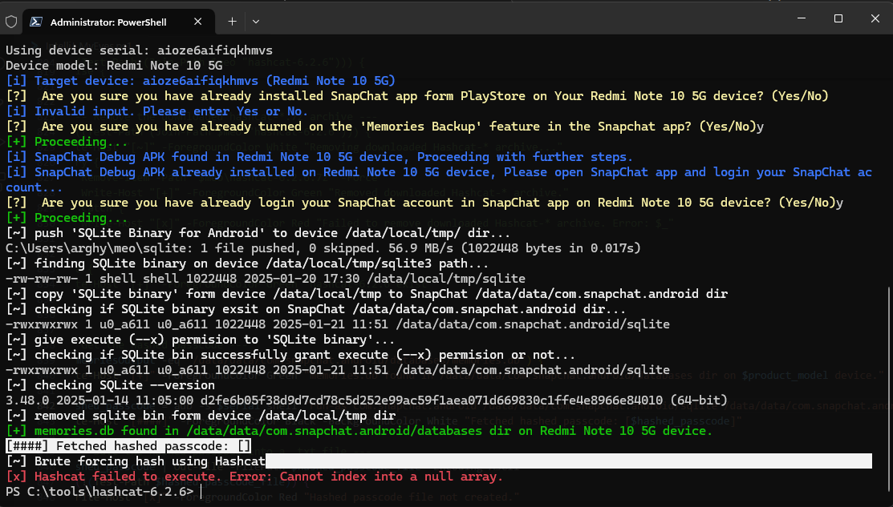

# How to MEO Passcode Work?

When you create MEO Passcode, MEO Passcode convert into hashed_passcode that store on both passcode created device and SnapChat Server, and all your My Eyes Only Memories are also sync to SnapChat cloud (Server).

When you login your [SnapChat accounts](https://accounts.snapchat.com/) on a new device and first time unlocking My Eyes Only its required internet connection, 

when your enter your MEO Passcode its convert into hashed_passcode using bcrypt encryption this converted hashed_passcode and hashed_passcode that store on SnapChat Server both are compaired and when both are match its store on new device /data/data/com.snapchat.android/databases/memories.db file,

this is a databases (.db) file so you can view this hashed_passcode using SQLite.

so impossible to view this memories.db file without superuser permission or debuggable package (debug apk) becouse android system restricted to view snapchat private dir

when decompile package and modify the manifest file to set `android:debuggable="true"` to the `<application>` tag and makeDebuggable package its requied to sign package during compile to install on device

if you non-rooted user and trying this script on your device this script required [Core Patch](https://github.com/LSPosed/CorePatch/releases) [LSPosed](https://github.com/JingMatrix/LSPosed/releases) Module to bypass android signature varification features to bypass both installed SnapChat release apk and this debuggable SnapChat apk signature varification to install this debuggable apk without uninstalling releases apk. to hook [Core Patch](https://github.com/LSPosed/CorePatch/releases) Module in System Framework you need to flash [LSPosed](https://github.com/JingMatrix/LSPosed/releases) Magisk Module form [Magisk](https://github.com/topjohnwu/Magisk/releases) or [KernelSU](https://github.com/tiann/KernelSU)/[APatch](https://github.com/bmax121/APatch) or [MMRL](https://github.com/DerGoogler/MMRL/releases). Note: to use [LSPosed](https://github.com/JingMatrix/LSPosed/releases) Module required [Zygisk](https://de.wikipedia.org/wiki/Zygisk) to inject [Core Patch](https://github.com/LSPosed/CorePatch) Module code in a system framework, so finaly to use [LSPosed](https://github.com/JingMatrix/LSPosed) required [Zygisk](https://de.wikipedia.org/wiki/Zygisk) and if you [Magisk](https://github.com/topjohnwu/Magisk) user enabled [Zygisk](https://de.wikipedia.org/wiki/Zygisk) service form [Magisk](https://github.com/topjohnwu/Magisk) app Settings, if you are using [KernelSU](https://github.com/tiann/KernelSU) or [APatch](https://github.com/bmax121/APatch) you need [ZygiskNext](https://github.com/Dr-TSNG/ZygiskNext/releases) Module to enabled [Zygisk](https://de.wikipedia.org/wiki/Zygisk) service and use LSPosed Module.

to install [Magisk](https://github.com/topjohnwu/Magisk/releases) or [KernelSU](https://github.com/tiann/KernelSU)/[APatch](https://github.com/bmax121/APatch) required [Bootloader unlocking](https://en.wikipedia.org/wiki/Bootloader_unlocking)

so if you are trying to crack MEO Passcode using this scipt required [CorePatch](https://github.com/LSPosed/CorePatch/releases) without this [LSPosed](https://github.com/JingMatrix/LSPosed/releases) Module you get `null` error during craking bucouse this script uninstall release apk and install debug apk if [CorePatch](https://github.com/LSPosed/CorePatch/releases) Module not find on target device, due to difference signature both SnapChat Developer provide in release apk and me provide in Debug apk.

# This Script work on non-rooted device?

Nah! This script work on both rooted and non-rooted device if SnapChat Developer Team decide to remove this type MEO restore method. Also remove other unusual activity (`android:debuggable="true"` or SHA256 signature math) detection during SnapChat accounts login in SnapChat app.

# Summary

to use this script doesn't required [Superuser](https://en.wikipedia.org/wiki/Superuser) permission but required [CorePatch](https://github.com/LSPosed/CorePatch/releases) [LSPosed](https://github.com/JingMatrix/LSPosed/releases) Module hook in System Framework!
